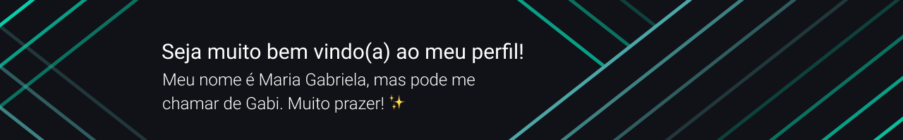

<!-- ## Oiee, eu sou a Maria Gabriela, muito prazer! :sparkles: -->

  

Sou formada em Desenvolvimento de Software Multiplataforma e também Técnica em Informática, com experiência em desenvolvimento front-end e gestão de projetos :sparkles: 
> :computer: Atualmente Dev Frontend (com React/Next) e freelancer!

- :heart: Sempre gostei de criar interfaces bonitas e funcionais, comecei com HTML e CSS e depois conheci o mundo do JavaScript e TypeScript com o Node, React e React Native, mas também já trabalhei com Dart/Flutter!
- Amo criar projetos, trabalhar em equipe ou sozinha, então sempre que posso participo de eventos de programação e cursos 🚀
- :mag_right: Meus interesses são: desenvolvimento front-end, gestão de projetos e metodologias ágeis
- **Curiosidades sobre mim:** tenho 1,48 de altura e adoro bolo de pote :cake:

Se quiser entrar em contato comigo, você pode me mandar uma mensagem pelo [Linkedin](https://www.linkedin.com/in/mariagabrielareis/) ou me mandar um email!

   
Meus status (total de commits, PRs, issues e tecnologias mais usadas!)

  
|  |  |  |
| :-: | :-: | :-: |

|  |  |
| :-: | :-: |

   
Meus troféus no GitHub

  

  

